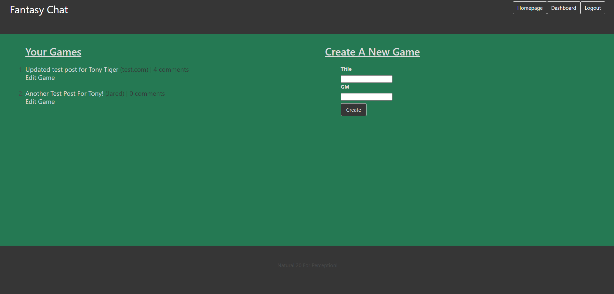

# Fantasy-Chat

## Description
---

- This application is designed to bring RPG lovers together and allow them to contribute to an expansive and long lasting experience while documenting every key move and roll along the way. A user is able to make a post, have other logged in users contribute to the extensive campaign through the comments, and also roll die depending on the associated encounter. Posts can be made by any verified user and can involve as many players as desired.

## Table of Contents
---
- [Technologies Used](#technologies-used)
- [Website](#website)
- [License Information](#license-information)
- [Website Thumbnail](#website-thumbnail)
- [Developer Information](#developer-information)

## Technologies Used
---

- Javascript
- Handlebars
- Sequelize
- Express
- Express-sessions
- MySQL
- HTML
- Bulma
- Node.js
- JAWSDB

## Website
---
[Deployed Heroku Website](https://vast-refuge-25222.herokuapp.com/login)

## License Information
---

 

## Website Thumbnail
---

## Developer Information
---

For any further questions regarding this application or future developments, please feel free to reach out to us here!

- GitHub: [kyrotomato](https://github.com/kyrotomato) 
- GitHub: [JonCurls](https://github.com/JonCurls)
- GitHub: [jared-ruiz](https://github.com/jared-ruiz)

---
## Made with ❤️💧🩸
